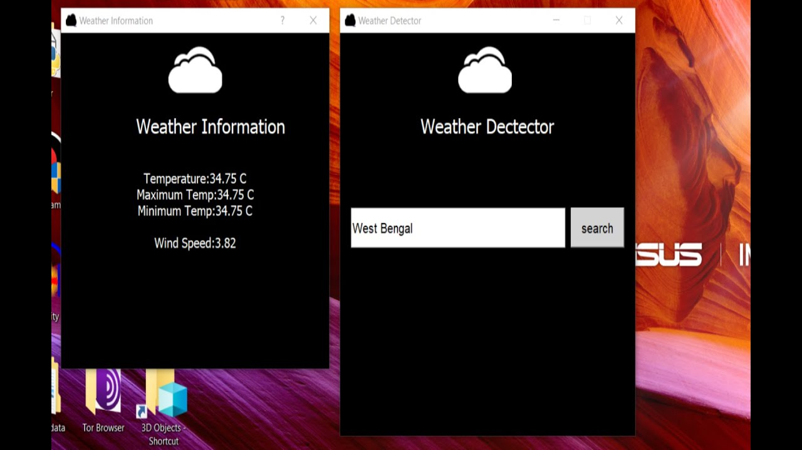

# Weather Detector with PyQt5

This is a weather detector application built using PyQt5, a Python library for creating graphical user interfaces. The application allows users to retrieve weather information for a specific location by entering the city name.

## Features

- Retrieve weather information for a given city
- Display current weather conditions, including temperature, humidity, and wind speed
- Show a weather icon based on the current weather condition
- Provide a 5-day forecast with detailed weather information
- Support for both metric and imperial unit systems
- User-friendly interface with responsive design

## Installation

1. Clone the repository:

```bash
git clone https://github.com/Ankur960/weather-detector.git
```

2. Change into the project directory:

```bash
cd weather-detector
```

3. Install the required dependencies using pip:

```bash
pip install -r requirements.txt
```

## Usage

1. Run the application:

```bash
python main.py
```

2. Enter the city name in the provided input field.
3. Click the "Get Weather" button to retrieve the weather information.
4. The current weather conditions will be displayed, along with the weather icon

## Screenshots



## Contributing

Contributions are welcome! If you find any bugs or have suggestions for improvement, please open an issue or submit a pull request.

## License

This project is licensed under the [MIT License](LICENSE).

## Acknowledgments

- The weather data is provided by [OpenWeather](https://openweathermap.org/).
- Weather icons are sourced from [Flaticon](https://www.flaticon.com/).
